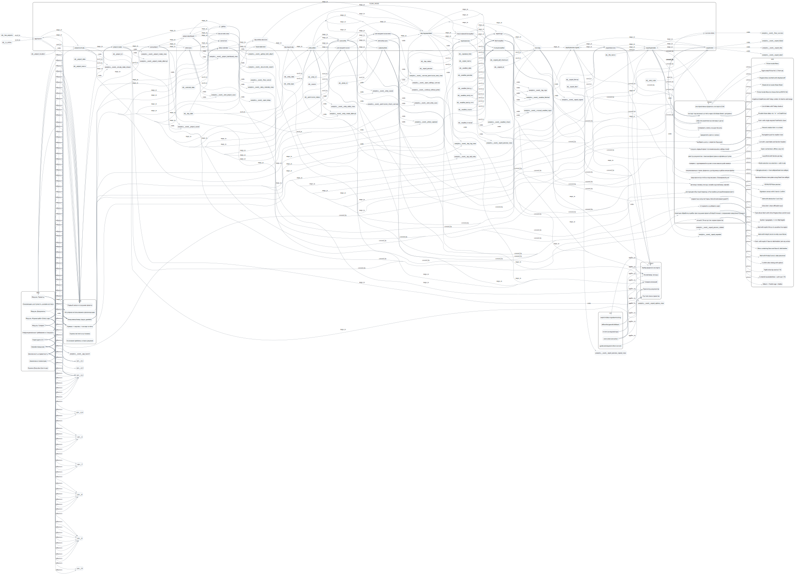

# SpecHub Overview

- Sections (PRD): 11
- Stages (CJM): 6
- User Flow nodes: 31
- Stories: 17
- Contextual UX screens: 5

## Coverage Landscape

## How to edit sources

Use the ✏️ Edit source links on each page section to jump to the corresponding modular JSON in `specs/`.